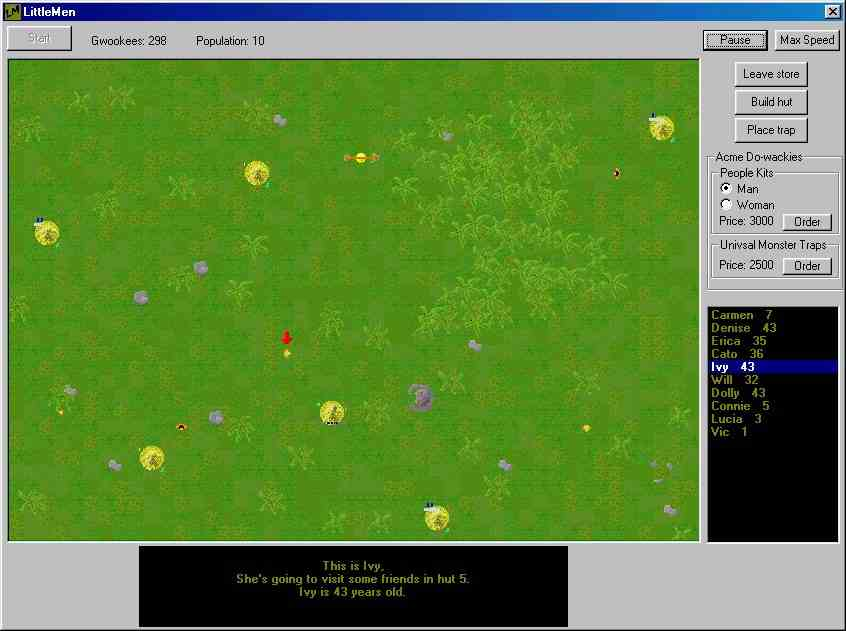



## LittleMen \- A must\-have game :\)

### Description

Tired of all these BORING "data from txt", "hide the minimize button" projects ;) ? Well then this is just the thing for you! And all you others too! A REALLY FUN GAME!! This is a BIG game, with full graphics, AI and hilarious sound! A MUST SEE! This is guaranteed something you do NOT see every day here on PLSC. I'm not kiddin' you must see this, I spend weeks on it (and I think I'll develop it even further) and truly is a lot of fun! Truly a one of a kind VB project, and I spend lots of hours on it so, I beg you, GIVE ME FEEDBACK!!! PLEASE! =) ANY kind will do! And if you like it, please give it a vote :) I'm not pushing you, hehe.
 
### More Info
 

             |
---                |---
**Submitted On**   |2001-08-21 21:59:42
**By**             |[Jonas Ask](https://github.com/Planet-Source-Code/PSCIndex/blob/master/ByAuthor/jonas-ask.md)
**Level**          |Intermediate
**User Rating**    |4.8 (43 globes from 9 users)
**Compatibility**  |VB 6\.0
**Category**       |[Games](https://github.com/Planet-Source-Code/PSCIndex/blob/master/ByCategory/games__1-38.md)
**World**          |[Visual Basic](https://github.com/Planet-Source-Code/PSCIndex/blob/master/ByWorld/visual-basic.md)
**Archive File**   |[LittleMen 253348252001\.zip](https://github.com/Planet-Source-Code/jonas-ask-littlemen-a-must-have-game__1-26649/archive/master.zip)

